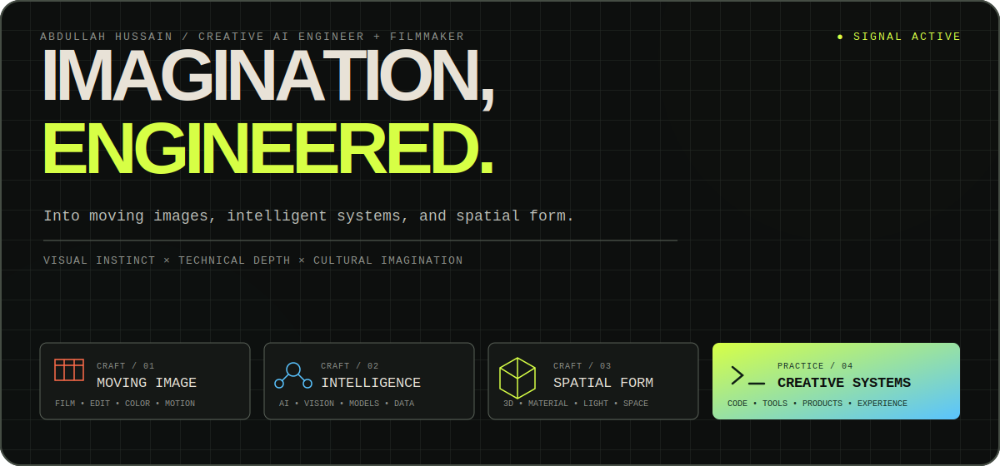
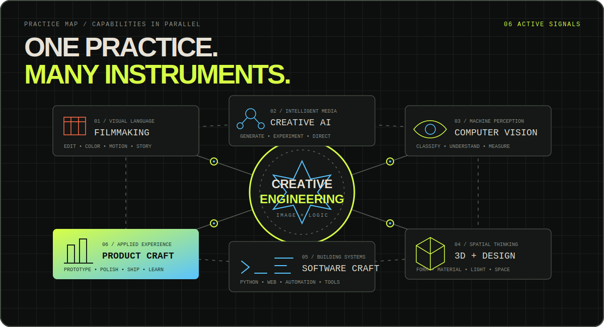
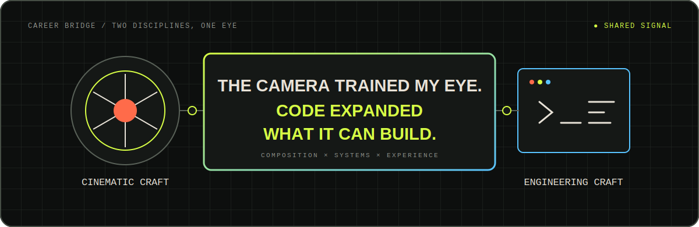

  

## Creative AI engineer, filmmaker, and visual systems builder

I engineer imagination into **moving images**, **intelligent systems**, and
**spatial form**.

My filmmaking background trained my eye for composition, rhythm, light, emotion,
and detail. Engineering gave that eye a larger set of instruments: models, code,
geometry, data, and interactive systems.

## Practice map

  

| Moving image | Intelligent systems | Spatial form | Creative systems |
|---|---|---|---|
| Filmmaking, editing, color, motion | Creative AI, computer vision, ML | 3D, materials, lighting, design | Software, tools, prototypes, products |

  

## Capability notes

<strong>Creative AI & machine learning</strong>

- Generative and multimodal AI experimentation
- Computer vision, image understanding, and visual classification
- Transformer-based model training and evaluation
- Dataset design, experiment tracking, metrics, and iterative model improvement
- Responsible use of AI as an amplifier for human taste and judgment

<strong>3D, spatial & engineering design</strong>

- 3D design, procedural form, and spatial problem-solving
- Industrial and engineering design thinking
- Physically based materials, lighting, and rendering
- Visual tools that make complex spatial ideas easier to understand and use
- A strong interest in the relationship between code, geometry, and fabrication

<strong>Filmmaking & visual storytelling</strong>

- More than three years of filmmaking and visual-media practice
- Video production, editing, color grading, animation, and motion
- Composition, sequencing, visual rhythm, art direction, and graphic design
- An engineering-led approach to color, image quality, and repeatable results
- Experience translating concepts into emotionally clear visual language

<strong>Software & product craft</strong>

- Python-led applied AI development
- Interactive web experiences and full-stack prototypes
- Creative coding, automation, and internal tools
- Fast experimentation without losing sight of polish or usability
- Moving comfortably between research questions and user-facing experiences

## Public work & recognition

- Built public experiments across creative image transformation, computer vision,
  model training, visual interfaces, and automation.
- My AI artwork reimagining Bollywood figures through the visual world of
  *Barbie* received international entertainment-media coverage from
  [The Times of India](https://timesofindia.indiatimes.com/life-style/spotlight/web-stories/ai-imagines-bollywood-celebs-in-the-barbie-world/photostory/101855715.cms),
  [IndiaTimes](https://www.indiatimes.com/ampstories/entertainment/virat-anushka-to-deepika-ranveer-ai-reimagines-popular-bollywood-celebrity-couples-in-barbie-world-609792.html),
  [MensXP](https://www.mensxp.com/ampstories/buzz-on-web/latest/139474-ai-imagines-bollywood-actors-in-the-barbie-film-latest-trending-alia-priyanka-margot-robbie.html),
  and [Onmanorama](https://www.onmanorama.com/entertainment/entertainment-news/2023/07/20/barbie-movie-bollywood-actors-ai-reimagination-priyanka-chopra-nick-jonas.html).
- I approach color grading as a system to explore: beginning with the signal,
  questioning assumptions, and shaping the image with intent rather than presets.
- My broader practice connects storytelling, visual culture, emerging AI, and
  engineering design.

## Working vocabulary

`Creative AI` · `Computer Vision` · `Machine Learning` · `Python` · `Transformers` ·
`3D Design` · `Industrial Design` · `Engineering Design` · `Creative Coding` ·
`Filmmaking` · `Video Editing` · `Color Grading` · `Animation` · `Visual Production`

## Elsewhere

[LinkedIn](https://www.linkedin.com/in/abdullah-hanxie-338519252/) ·
[Instagram](https://www.instagram.com/abdullahanxie/) ·
[GitHub repositories](https://github.com/abdullahanxie?tab=repositories)
