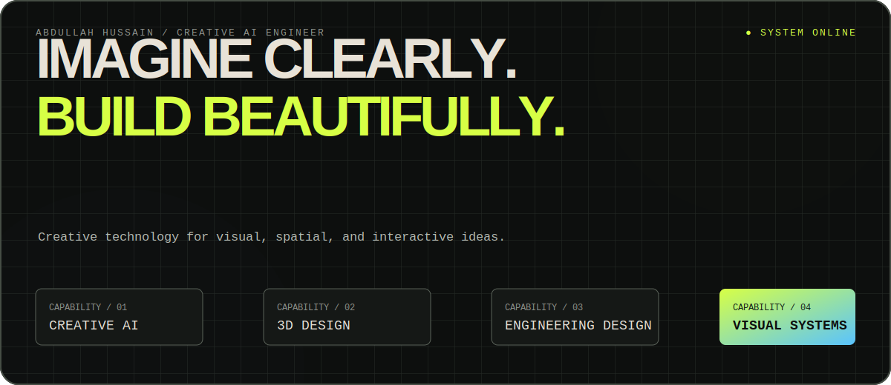

  

## Creative AI Engineer

I combine engineering thinking with visual craft to create expressive,
useful experiences across digital and spatial media.

### Capabilities

| Creative technology | Design |
|---|---|
| Creative AI and intelligent experiences | 3D and industrial design |
| Interactive prototypes and tools | Engineering and product design |
| Visual systems and experimentation | Animation and visual production |

### How I work

I enjoy ambiguous ideas, difficult technical questions, and the moment a rough
concept becomes something people can see, understand, and use. My work balances:

- **Imagination** with implementation
- **Visual quality** with technical precision
- **Experimentation** with practical outcomes

### Connect

[LinkedIn](https://www.linkedin.com/in/abdullah-hanxie-338519252/) ·
[Instagram](https://www.instagram.com/abdullahanxie/)

  <strong>Imagine clearly. Build beautifully.</strong>

<!-- Public profile: capabilities only. -->
