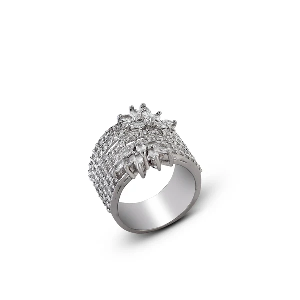

  

## Hi, I'm Abdullah.

I started with filmmaking. Editing and color grading taught me to notice rhythm,
light, composition, and all the small choices that make an image feel right.
Later I moved deeper into engineering and AI, but I never left that way of
looking at things behind.

These days I write code, train vision models, work with 3D, and build tools for
creative people. I like projects where the technical problem and the visual
problem are really the same problem.

## Image to 3D jewelry study

  

  This starts from a jewelry reference image and opens as an interactive GLB:
  diamond stones, a silver body, and selectable construction details.

  Open the 3D viewer to inspect the silver and diamond material pass.

## A little more about the work

<strong>AI and computer vision</strong>

I enjoy working close to the image itself. I have trained transformer-based
vision models, worked on visual classification, built datasets, tracked
experiments, and spent a lot of time understanding why a model gets something
wrong. I also explore generative and multimodal AI, especially where it can give
artists and designers more control instead of making their choices for them.

<strong>3D and design</strong>

I am interested in form, materials, light, and how an idea changes once it
becomes spatial. My work moves between 3D design, rendering, engineering design,
and the tools needed to make complex geometry understandable and useful.

<strong>Film and visual work</strong>

Filmmaking is still a big part of how I think. I have more than three years of
experience across video production, editing, color grading, animation, and
graphic design. Even when I am building software, I am usually thinking about
the sequence, the feeling, and what the person on the other side will see.

<strong>Software and experiments</strong>

Python is usually where I begin, but I also build web interfaces, prototypes,
automation, and small tools whenever an idea needs a shape. I prefer making a
working version early, learning from it, and improving the parts that actually
matter.

## Something people noticed

In 2023 I used AI to reimagine Bollywood figures inside the visual world of
*Barbie*. The images travelled much further than I expected and were featured by
[The Times of India](https://timesofindia.indiatimes.com/life-style/spotlight/web-stories/ai-imagines-bollywood-celebs-in-the-barbie-world/photostory/101855715.cms),
[IndiaTimes](https://www.indiatimes.com/ampstories/entertainment/virat-anushka-to-deepika-ranveer-ai-reimagines-popular-bollywood-celebrity-couples-in-barbie-world-609792.html),
[MensXP](https://www.mensxp.com/ampstories/buzz-on-web/latest/139474-ai-imagines-bollywood-actors-in-the-barbie-film-latest-trending-alia-priyanka-margot-robbie.html),
and [Onmanorama](https://www.onmanorama.com/entertainment/entertainment-news/2023/07/20/barbie-movie-bollywood-actors-ai-reimagination-priyanka-chopra-nick-jonas.html).
That project reminded me that technical experiments can still carry culture,
humor, and a point of view.

You can find me on
[LinkedIn](https://www.linkedin.com/in/abdullah-hanxie-338519252/),
[Instagram](https://www.instagram.com/abdullahanxie/), or around my
[GitHub repositories](https://github.com/abdullahanxie?tab=repositories).
